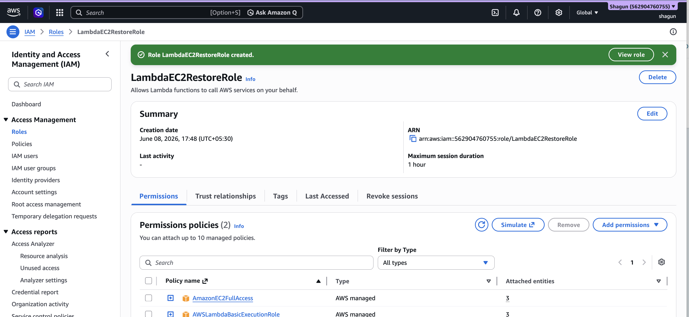
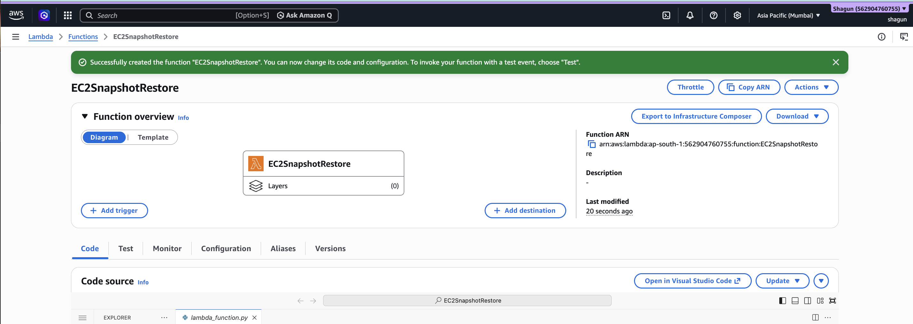
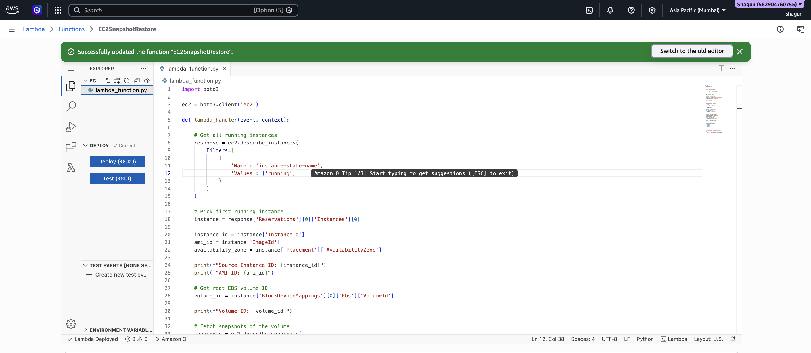
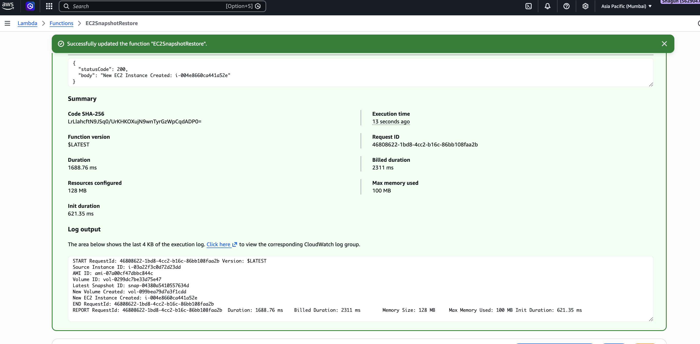
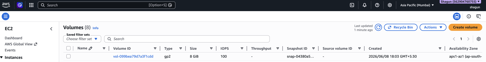
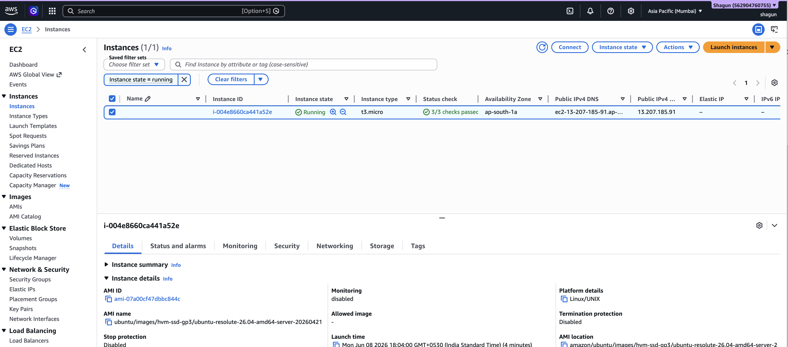
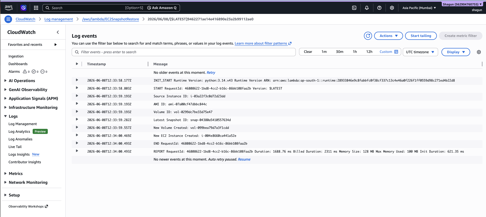

# Assignment 17: Restore EC2 Instance from Snapshot

## Objective

The objective of this assignment is to automate the EC2 recovery process using AWS Lambda and Boto3.

The Lambda function performs the following tasks:
- Fetches the latest snapshot of an EC2 instance
- Creates a new EBS volume from the snapshot
- Launches a new EC2 instance automatically

---

# AWS Services Used

- AWS Lambda
- Amazon EC2
- Amazon EBS Snapshots
- AWS IAM
- Amazon CloudWatch
- Boto3

---

# Project Structure

```text
Assignment17/
│
├── README.md
│
├── screenshots/
│   ├── 1_IAM_Role_For_Lambda.png
│   ├── 2_Lambda_Function_Creation.png
│   ├── 3_Lambda_Boto3_Code.png
│   ├── 4_Lambda_Test_Run.png
│   ├── 5_New_EBS_Volume.png
│   ├── 6_Restored_EC2_Instance.png
│   └── 7_CloudWatch_Logs.png
```

---

# Architecture Flow

```text
Lambda Function Triggered
        ↓
Fetch Running EC2 Instance Details
        ↓
Retrieve Latest Snapshot
        ↓
Create New EBS Volume
        ↓
Launch New EC2 Instance
        ↓
Store Logs in CloudWatch
```

---

# Step 1: Create IAM Role for Lambda

## Steps

1. Open AWS Console
2. Navigate to:
   ```text
   IAM → Roles → Create Role
   ```

3. Select:
   - AWS Service
   - Lambda

4. Attach Policies:
   - AmazonEC2FullAccess
   - AWSLambdaBasicExecutionRole

5. Role Name:
   ```text
   LambdaEC2RestoreRole
   ```

6. Click:
   ```text
   Create Role
   ```

---

# Screenshot

## IAM Role for Lambda



### Screenshot Description
This screenshot shows:
- IAM role created for Lambda
- Attached EC2 permissions
- CloudWatch logging permissions

---

# Step 2: Create Lambda Function

## Steps

1. Open:
   ```text
   AWS Lambda Console
   ```

2. Click:
   ```text
   Create Function
   ```

3. Choose:
   ```text
   Author from scratch
   ```

4. Configure:
   - Function Name:
     ```text
     EC2SnapshotRestore
     ```
   - Runtime:
     ```text
     Python 3.x
     ```

5. Select Existing Role:
   ```text
   LambdaEC2RestoreRole
   ```

6. Click:
   ```text
   Create Function
   ```

---

# Screenshot

## Lambda Function Creation



### Screenshot Description
This screenshot shows:
- Lambda function creation
- Python runtime
- Assigned execution role

---

# Step 3: Add Lambda Python Code

Replace the default Lambda code with:

```python
import boto3

ec2 = boto3.client('ec2')

def lambda_handler(event, context):

    # Get all running EC2 instances
    response = ec2.describe_instances(
        Filters=[
            {
                'Name': 'instance-state-name',
                'Values': ['running']
            }
        ]
    )

    # Select first running instance
    instance = response['Reservations'][0]['Instances'][0]

    instance_id = instance['InstanceId']
    ami_id = instance['ImageId']
    availability_zone = instance['Placement']['AvailabilityZone']

    print(f"Source Instance ID: {instance_id}")
    print(f"AMI ID: {ami_id}")

    # Get root volume ID
    volume_id = instance['BlockDeviceMappings'][0]['Ebs']['VolumeId']

    print(f"Volume ID: {volume_id}")

    # Fetch snapshots
    snapshots = ec2.describe_snapshots(
        Filters=[
            {
                'Name': 'volume-id',
                'Values': [volume_id]
            }
        ],
        OwnerIds=['self']
    )

    snapshot_list = snapshots['Snapshots']

    # Sort snapshots by latest
    snapshot_list.sort(
        key=lambda x: x['StartTime'],
        reverse=True
    )

    latest_snapshot = snapshot_list[0]

    snapshot_id = latest_snapshot['SnapshotId']

    print(f"Latest Snapshot ID: {snapshot_id}")

    # Create new volume
    new_volume = ec2.create_volume(
        SnapshotId=snapshot_id,
        AvailabilityZone=availability_zone,
        VolumeType='gp2'
    )

    new_volume_id = new_volume['VolumeId']

    print(f"New Volume Created: {new_volume_id}")

    # Launch new EC2 instance
    new_instance = ec2.run_instances(
        ImageId=ami_id,
        MinCount=1,
        MaxCount=1,
        InstanceType='t3.micro',
        Placement={
            'AvailabilityZone': availability_zone
        }
    )

    new_instance_id = new_instance['Instances'][0]['InstanceId']

    print(f"New EC2 Instance Created: {new_instance_id}")

    return {
        'statusCode': 200,
        'body': f'New EC2 Instance Created: {new_instance_id}'
    }
```

---

# Screenshot

## Lambda Boto3 Code



### Screenshot Description
This screenshot shows:
- Dynamic EC2 instance fetching
- Snapshot retrieval logic
- EBS volume creation
- EC2 instance launch logic

---

# Step 4: Test Lambda Function

## Steps

1. Click:
   ```text
   Test
   ```

2. Create test event:
   ```json
   {}
   ```

3. Click:
   ```text
   Invoke/Test
   ```

4. Verify successful execution.

---

# Screenshot

## Lambda Test Execution



### Screenshot Description
This screenshot shows:
- Lambda test success
- Output response
- Status code

---

# Step 5: Verify New EBS Volume

## Steps

1. Open:
   ```text
   EC2 Console
   ```

2. Navigate to:
   ```text
   Elastic Block Store → Volumes
   ```

3. Verify newly created volume.

---

# Screenshot

## New EBS Volume



### Screenshot Description
This screenshot shows:
- Newly restored EBS volume
- Volume state
- Availability Zone

---

# Step 6: Verify Restored EC2 Instance

## Steps

1. Open:
   ```text
   EC2 → Instances
   ```

2. Verify the newly created instance.

---

# Screenshot

## Restored EC2 Instance



### Screenshot Description
This screenshot shows:
- Newly launched EC2 instance
- Running state
- Instance type

---

# Step 7: Verify CloudWatch Logs

## Steps

1. Open:
   ```text
   CloudWatch
   ```

2. Navigate to:
   ```text
   Log Groups
   ```

3. Open:
   ```text
   /aws/lambda/EC2SnapshotRestore
   ```

4. Verify execution logs.

Example Logs:

```text
Source Instance ID: i-xxxxxxxx
Latest Snapshot ID: snap-xxxxxxxx
New Volume Created: vol-xxxxxxxx
New EC2 Instance Created: i-yyyyyyyy
```

---

# Screenshot

## CloudWatch Logs



### Screenshot Description
This screenshot shows:
- Lambda execution logs
- Snapshot details
- Volume creation logs
- EC2 instance creation logs

---

# Final Output

The Lambda function successfully:
- Fetches the latest snapshot
- Creates a new EBS volume
- Launches a restored EC2 instance
- Stores logs in CloudWatch

---

# Conclusion

This assignment demonstrates automated EC2 disaster recovery using AWS Lambda and Boto3. The automation minimizes manual recovery effort and improves infrastructure reliability by restoring EC2 instances from the latest available snapshots automatically.

---
