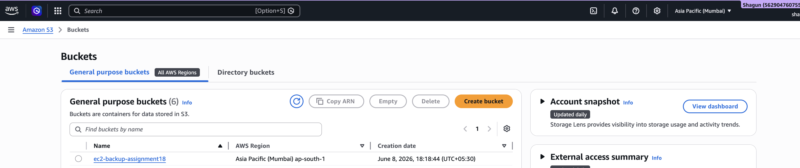
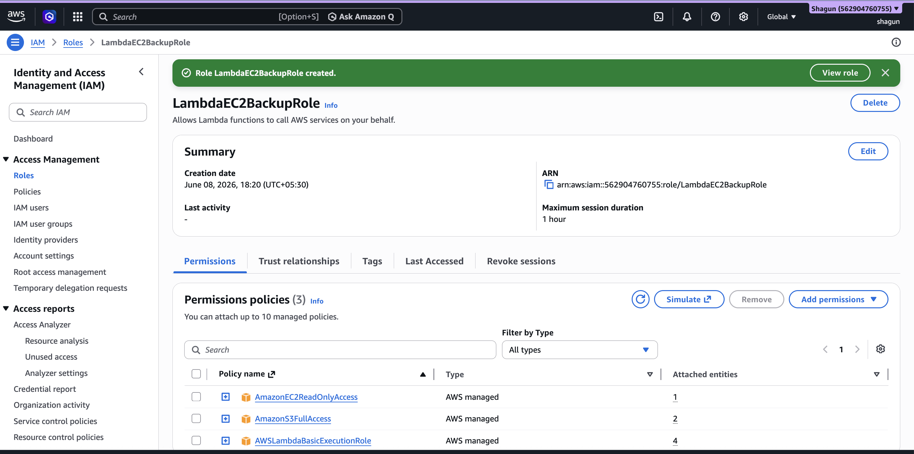
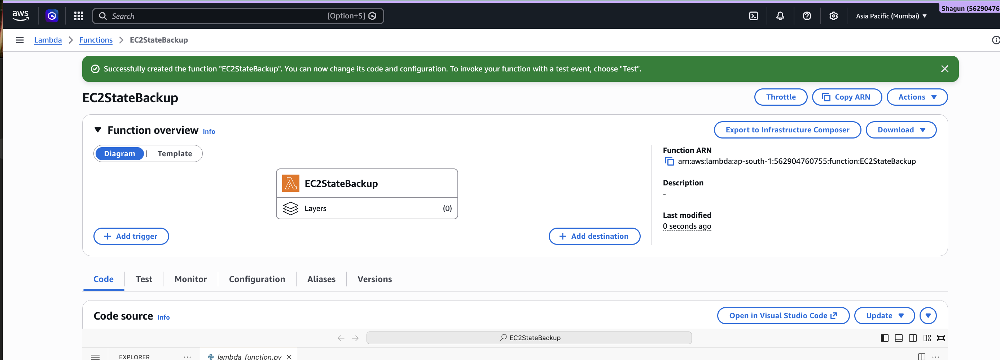
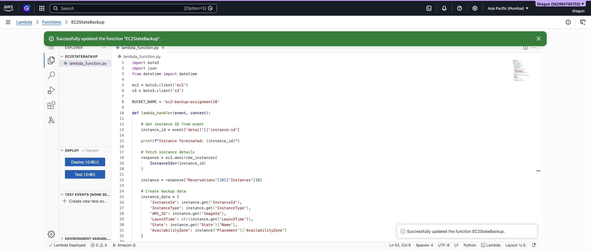
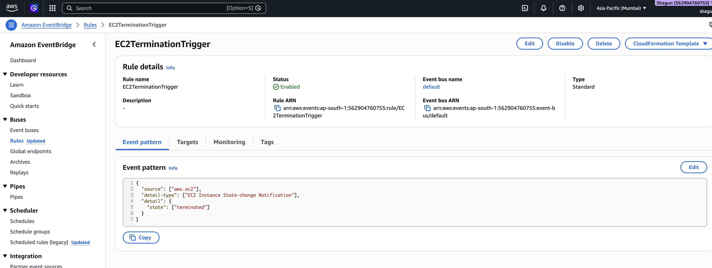
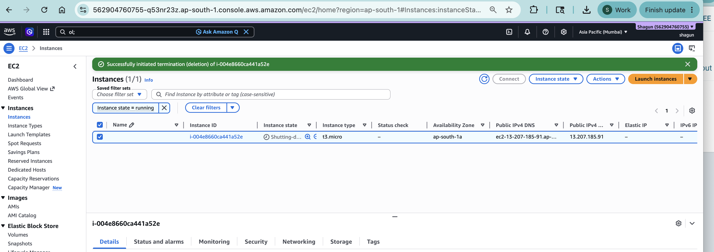
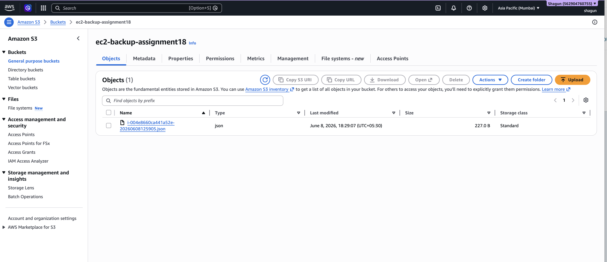
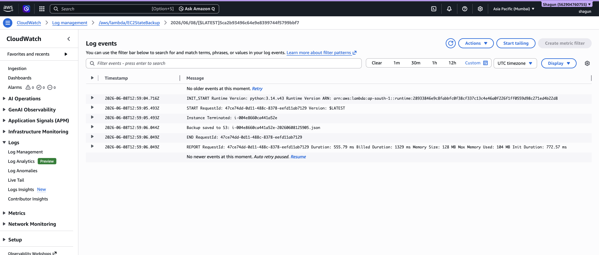

# Assignment 18: Autosave EC2 Instance State Before Shutdown

## Objective

The objective of this assignment is to automatically save EC2 instance information into an S3 bucket before the instance is terminated.

Using AWS Lambda, Boto3, and EventBridge:
- EC2 termination events are detected automatically
- Lambda fetches EC2 instance details
- Backup data is stored in an S3 bucket
- Logs are generated in CloudWatch

---

# AWS Services Used

- Amazon EC2
- AWS Lambda
- Amazon S3
- Amazon EventBridge
- AWS IAM
- Amazon CloudWatch
- Boto3

---

# Project Structure

```text
Assignment18/
│
├── README.md
│
├── screenshots/
│   ├── 1_S3_Bucket_Creation.png
│   ├── 2_IAM_Role_For_Lambda.png
│   ├── 3_Lambda_Function_Creation.png
│   ├── 4_Lambda_Boto3_Code.png
│   ├── 5_EventBridge_Rule.png
│   ├── 6_EC2_Instance_Termination.png
│   ├── 7_S3_Autosaved_File.png
│   └── 8_CloudWatch_Logs.png
```

---

# Architecture Flow

```text
EC2 Instance Termination
            ↓
EventBridge Detects Termination Event
            ↓
Triggers Lambda Function
            ↓
Lambda Fetches Instance Details
            ↓
Save Backup File to S3 Bucket
            ↓
CloudWatch Logs Generated
```

---

# Step 1: Create S3 Bucket

## Steps

1. Open AWS Console
2. Navigate to:
   ```text
   S3 → Create Bucket
   ```

3. Enter Bucket Name:
   ```text
   ec2-backup-assignment18
   ```

4. Keep default settings
5. Click:
   ```text
   Create Bucket
   ```

---

# Screenshot

## S3 Bucket Creation



### Screenshot Description
This screenshot shows:
- Successfully created S3 bucket
- Bucket name used for EC2 backups

---

# Step 2: Create IAM Role for Lambda

## Steps

1. Open:
   ```text
   IAM → Roles → Create Role
   ```

2. Select:
   - AWS Service
   - Lambda

3. Attach Policies:
   - AmazonEC2ReadOnlyAccess
   - AmazonS3FullAccess
   - AWSLambdaBasicExecutionRole

4. Role Name:
   ```text
   LambdaEC2BackupRole
   ```

5. Click:
   ```text
   Create Role
   ```

---

# Screenshot

## IAM Role for Lambda



### Screenshot Description
This screenshot shows:
- Lambda IAM execution role
- Attached EC2, S3, and CloudWatch permissions

---

# Step 3: Create Lambda Function

## Steps

1. Open:
   ```text
   AWS Lambda Console
   ```

2. Click:
   ```text
   Create Function
   ```

3. Choose:
   ```text
   Author from scratch
   ```

4. Configure:
   - Function Name:
     ```text
     EC2StateBackup
     ```

   - Runtime:
     ```text
     Python 3.x
     ```

5. Select Existing Role:
   ```text
   LambdaEC2BackupRole
   ```

6. Click:
   ```text
   Create Function
   ```

---

# Screenshot

## Lambda Function Creation



### Screenshot Description
This screenshot shows:
- Lambda function configuration
- Runtime selection
- Assigned execution role

---

# Step 4: Add Lambda Python Code

Replace the default Lambda code with:

```python
import boto3
import json
from datetime import datetime

ec2 = boto3.client('ec2')
s3 = boto3.client('s3')

BUCKET_NAME = 'ec2-backup-assignment18'

def lambda_handler(event, context):

    # Get instance ID from EventBridge event
    instance_id = event['detail']['instance-id']

    print(f"Instance Terminated: {instance_id}")

    # Fetch EC2 details
    response = ec2.describe_instances(
        InstanceIds=[instance_id]
    )

    instance = response['Reservations'][0]['Instances'][0]

    # Create backup data
    instance_data = {
        'InstanceId': instance.get('InstanceId'),
        'InstanceType': instance.get('InstanceType'),
        'AMI_ID': instance.get('ImageId'),
        'LaunchTime': str(instance.get('LaunchTime')),
        'State': instance.get('State')['Name'],
        'AvailabilityZone': instance['Placement']['AvailabilityZone']
    }

    # Convert data to JSON
    json_data = json.dumps(instance_data, indent=4)

    # File name
    file_name = f"{instance_id}-{datetime.now().strftime('%Y%m%d%H%M%S')}.json"

    # Upload backup file to S3
    s3.put_object(
        Bucket=BUCKET_NAME,
        Key=file_name,
        Body=json_data
    )

    print(f"Backup saved to S3: {file_name}")

    return {
        'statusCode': 200,
        'body': f'Successfully backed up {instance_id}'
    }
```

---

# Important

Replace this line if your bucket name is different:

```python
BUCKET_NAME = 'ec2-backup-assignment18'
```

---

# Deploy Lambda

Click:
```text
Deploy
```

---

# Screenshot

## Lambda Boto3 Code



### Screenshot Description
This screenshot shows:
- Python Boto3 script
- EC2 detail extraction
- S3 upload logic
- JSON backup creation

---

# Step 5: Create EventBridge Rule

## Steps

1. Open:
   ```text
   Amazon EventBridge
   ```

2. Navigate to:
   ```text
   Rules → Create Rule
   ```

3. Select:
   ```text
   Advanced Builder
   ```

4. Configure:
   - Rule Name:
     ```text
     EC2TerminationTrigger
     ```

5. Configure Event Pattern:
   - Event Source:
     ```text
     AWS Services
     ```

   - AWS Service:
     ```text
     EC2
     ```

   - Event Type:
     ```text
     EC2 Instance State-change Notification
     ```

   - State:
     ```text
     terminated
     ```

6. Configure Target:
   - Target Type:
     ```text
     AWS Service
     ```

   - Target:
     ```text
     Lambda Function
     ```

   - Function:
     ```text
     EC2StateBackup
     ```

7. Click:
   ```text
   Create Rule
   ```

---

# Screenshot

## EventBridge Rule



### Screenshot Description
This screenshot shows:
- EventBridge rule configuration
- EC2 termination event trigger
- Lambda target attachment

---

# Step 6: Terminate EC2 Instance

## Steps

1. Open:
   ```text
   EC2 → Instances
   ```

2. Select a test EC2 instance

3. Click:
   ```text
   Instance State → Terminate Instance
   ```

---

# Screenshot

## EC2 Instance Termination



### Screenshot Description
This screenshot shows:
- EC2 instance selected
- Instance termination action

---

# Step 7: Verify Backup File in S3

## Steps

1. Open:
   ```text
   S3 → ec2-backup-assignment18
   ```

2. Verify uploaded JSON backup file.

---

# Screenshot

## S3 Autosaved File



### Screenshot Description
This screenshot shows:
- Automatically uploaded backup JSON file
- S3 object generated after instance termination

---

# Step 8: Verify CloudWatch Logs

## Steps

1. Open:
   ```text
   CloudWatch
   ```

2. Navigate to:
   ```text
   Log Groups
   ```

3. Open:
   ```text
   /aws/lambda/EC2StateBackup
   ```

4. Verify Lambda execution logs.

Example:

```text
Instance Terminated: i-xxxxxxxx
Backup saved to S3: i-xxxxxxxx-20260608120000.json
```

---

# Screenshot

## CloudWatch Logs



### Screenshot Description
This screenshot shows:
- Lambda execution logs
- Successful S3 backup confirmation

---

# Example JSON Backup File

```json
{
    "InstanceId": "i-0123456789abcdef0",
    "InstanceType": "t3.micro",
    "AMI_ID": "ami-xxxxxxxx",
    "LaunchTime": "2026-06-08 10:00:00+00:00",
    "State": "terminated",
    "AvailabilityZone": "ap-south-1a"
}
```

---

# Final Output

Whenever an EC2 instance is terminated:
- EventBridge detects the termination event
- Lambda automatically executes
- EC2 instance data is stored in S3
- Execution logs are generated in CloudWatch

---

# Conclusion

This assignment demonstrates automated EC2 state backup using AWS Lambda, EventBridge, Amazon S3, and Boto3. The automation improves infrastructure auditing, monitoring, and recovery processes by preserving EC2 metadata before instance termination.

---
