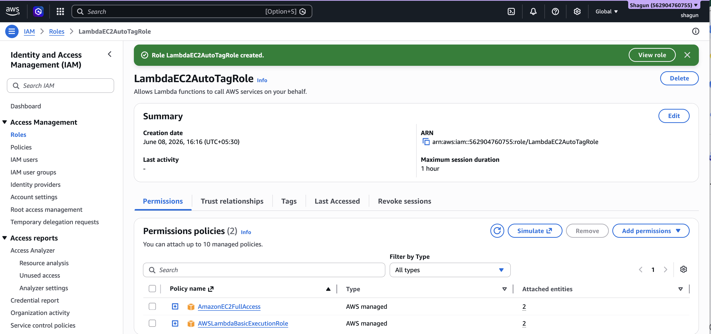
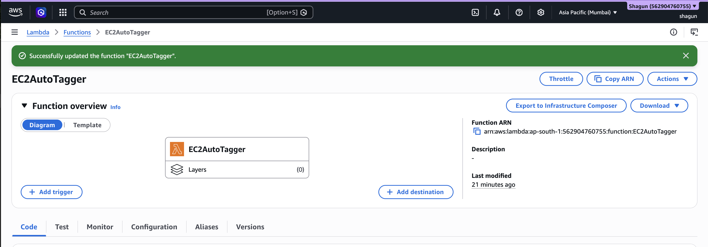
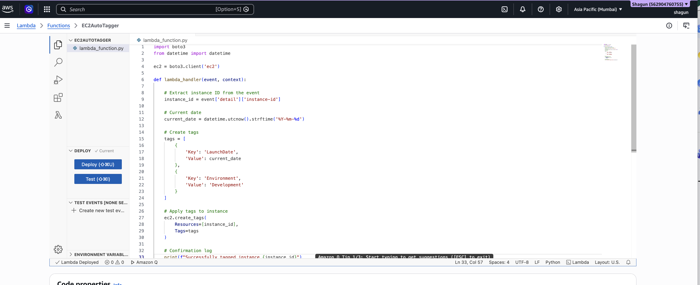
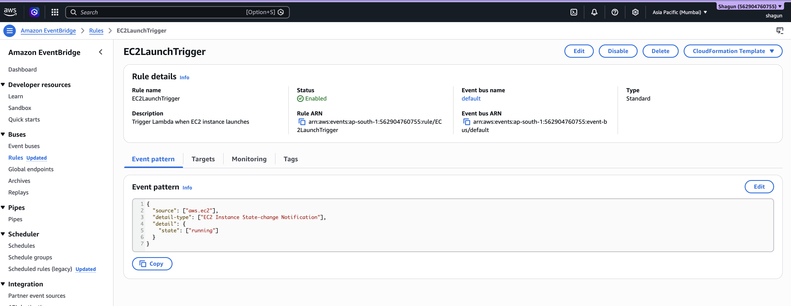
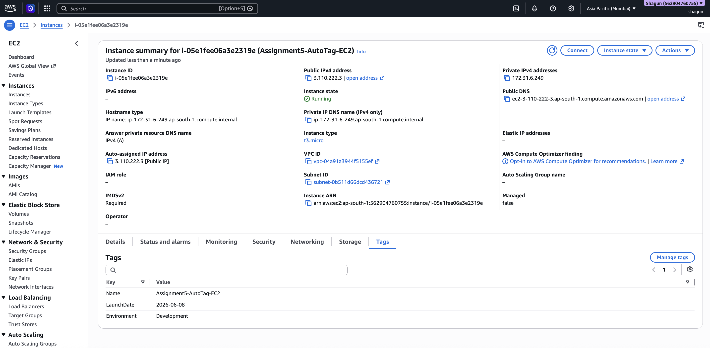
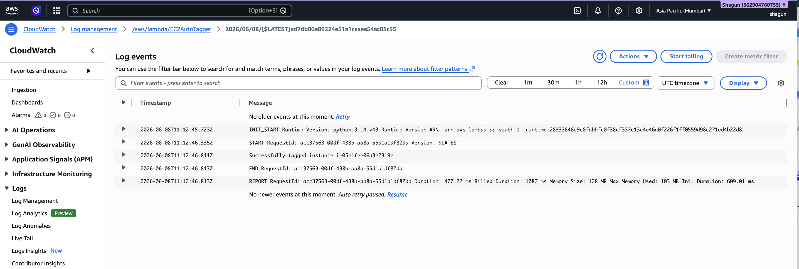

# Assignment 5: Auto-Tagging EC2 Instances on Launch Using AWS Lambda and Boto3

## Objective

The objective of this assignment is to automate the tagging of newly launched EC2 instances using AWS Lambda and Boto3. Whenever a new EC2 instance enters the running state, AWS EventBridge triggers a Lambda function that automatically applies predefined tags.

---

# AWS Services Used

- Amazon EC2
- AWS Lambda
- AWS IAM
- Amazon EventBridge
- Amazon CloudWatch Logs
- Boto3

---

# Project Structure

```text
Assignment5/
│
├── README.md
│
├── screenshots/
│   ├── 1_IAM_Role_For_Lambda.png
│   ├── 2_Lambda_Function_Creation.png
│   ├── 3_Lambda_Boto3_Code.png
│   ├── 4_EventBridge_Rule.png
│   ├── 5_EC2_Instance_Tags.png
│   └── 6_CloudWatch_Lambda_Logs.png
```

---

# Architecture Flow

```text
EC2 Instance Launch
        ↓
EventBridge Detects EC2 Running State
        ↓
Triggers AWS Lambda Function
        ↓
Lambda Uses Boto3 to Add Tags
        ↓
Tags Applied to EC2 Instance
```

---

# Step 1: Create IAM Role for Lambda

1. Open AWS IAM Console
2. Navigate to:
   ```text
   Roles → Create Role
   ```

3. Choose:
   - AWS Service
   - Lambda

4. Attach the following policies:
   - AmazonEC2FullAccess
   - AWSLambdaBasicExecutionRole

5. Name the role:
   ```text
   LambdaEC2AutoTagRole
   ```

6. Create the role.

---

# Screenshot

## IAM Role for Lambda



### Screenshot Description
This screenshot shows:
- IAM role created for Lambda
- Attached policies:
  - AmazonEC2FullAccess
  - AWSLambdaBasicExecutionRole

---

# Step 2: Create Lambda Function

1. Open AWS Lambda Console
2. Click:
   ```text
   Create Function
   ```

3. Select:
   ```text
   Author from scratch
   ```

4. Configure:
   - Function Name:
     ```text
     EC2AutoTagger
     ```
   - Runtime:
     ```text
     Python 3.x
     ```

5. Select execution role:
   ```text
   LambdaEC2AutoTagRole
   ```

6. Create the function.

---

# Screenshot

## Lambda Function Creation



### Screenshot Description
This screenshot shows:
- Lambda function name
- Python runtime
- Execution role assignment

---

# Step 3: Add Lambda Function Code

Replace the default Lambda code with the following:

```python
import boto3
from datetime import datetime

ec2 = boto3.client('ec2')

def lambda_handler(event, context):

    # Get instance ID from event
    instance_id = event['detail']['instance-id']

    # Current date
    current_date = datetime.utcnow().strftime('%Y-%m-%d')

    # Tags to apply
    tags = [
        {
            'Key': 'LaunchDate',
            'Value': current_date
        },
        {
            'Key': 'Environment',
            'Value': 'Development'
        }
    ]

    # Apply tags
    ec2.create_tags(
        Resources=[instance_id],
        Tags=tags
    )

    # Confirmation log
    print(f"Successfully tagged instance {instance_id}")
```

Click:
```text
Deploy
```

---

# Screenshot

## Lambda Boto3 Code



### Screenshot Description
This screenshot shows:
- Python Boto3 code
- EC2 client initialization
- create_tags() function
- Tagging logic
- Logging statement

---

# Step 4: Create EventBridge Rule

1. Open:
   ```text
   Amazon EventBridge
   ```

2. Navigate to:
   ```text
   Rules → Create Rule
   ```

3. Select:
   ```text
   Advanced Builder
   ```

4. Configure:
   - Rule Name:
     ```text
     EC2LaunchTrigger
     ```

   - Event Bus:
     ```text
     default
     ```

5. Configure Event Pattern:
   - Event Source:
     ```text
     AWS Services
     ```

   - AWS Service:
     ```text
     EC2
     ```

   - Event Type:
     ```text
     EC2 Instance State-change Notification
     ```

   - State:
     ```text
     running
     ```

6. Add Target:
   - Target Type:
     ```text
     AWS Service
     ```

   - Target:
     ```text
     Lambda Function
     ```

   - Lambda Function:
     ```text
     EC2AutoTagger
     ```

7. Click:
   ```text
   Create Rule
   ```

---

# Screenshot

## EventBridge Rule Configuration



### Screenshot Description
This screenshot shows:
- EventBridge rule
- EC2 event trigger
- Running state
- Lambda target configuration

---

# Step 5: Test the Automation

1. Launch a new EC2 instance.
2. Wait for approximately 1–2 minutes.
3. Open:
   ```text
   EC2 → Instances
   ```

4. Select the newly launched instance.
5. Open the:
   ```text
   Tags
   ```
   section.

---

# Expected Tags

| Key | Value |
|------|------|
| LaunchDate | Current Date |
| Environment | Development |

---

# Screenshot

## EC2 Instance Auto Tags



### Screenshot Description
This screenshot shows:
- Automatically applied EC2 tags
- Launch date tag
- Custom environment tag

---

# Step 6: Verify CloudWatch Logs

1. Open:
   ```text
   CloudWatch → Log Groups
   ```

2. Open:
   ```text
   /aws/lambda/EC2AutoTagger
   ```

3. Verify logs similar to:

```text
Successfully tagged instance i-xxxxxxxx
```

---

# Screenshot

## CloudWatch Lambda Logs



### Screenshot Description
This screenshot shows:
- Lambda execution logs
- Successful tagging confirmation

---

# Final Output

Whenever a new EC2 instance is launched:
- EventBridge detects the EC2 running event
- Lambda function is triggered
- Boto3 automatically tags the instance
- Logs are stored in CloudWatch

---

# Conclusion

This assignment demonstrates serverless automation using AWS Lambda, EventBridge, and Boto3. Automatic tagging improves cloud resource management, monitoring, and governance while reducing manual effort.

---
